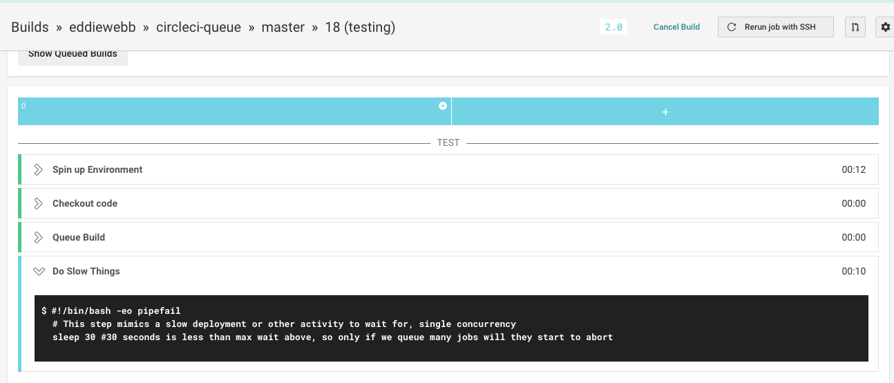
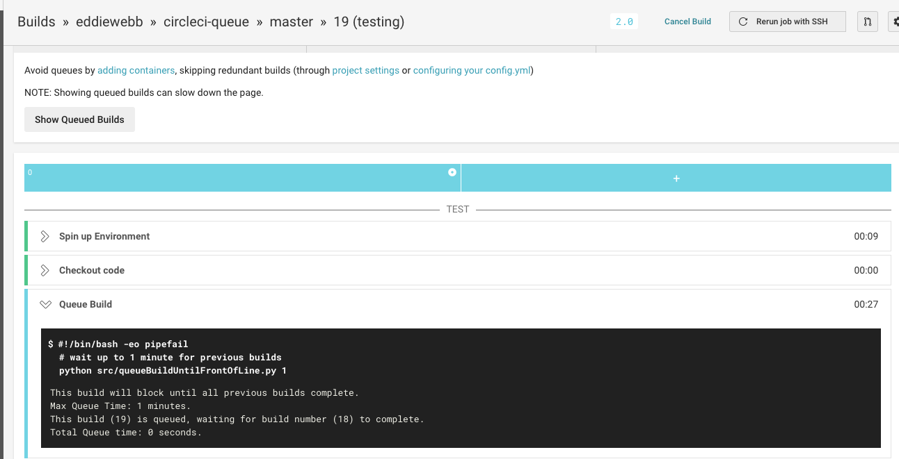
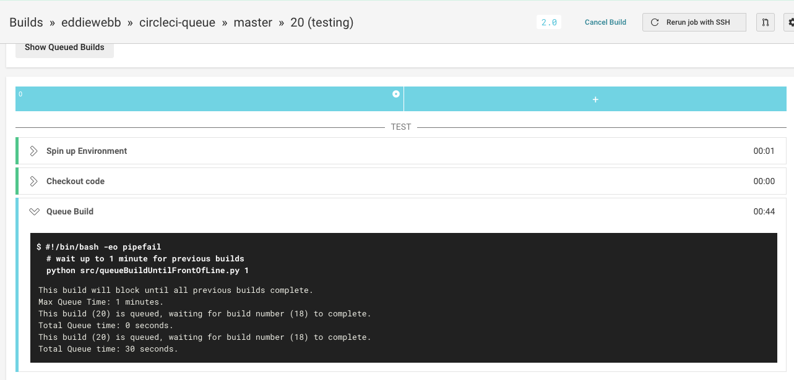
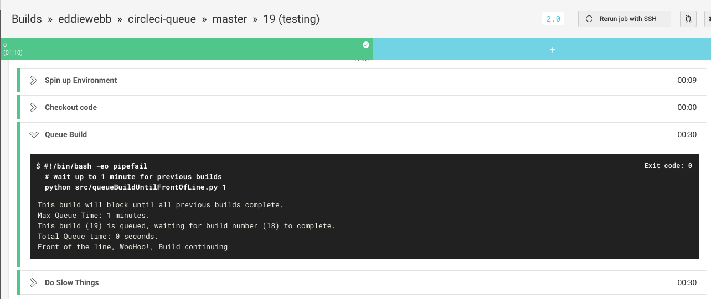
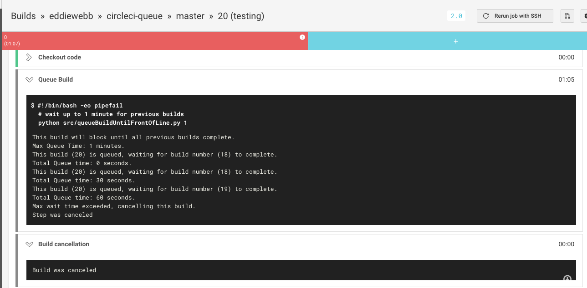

# CircleCI Concurrency Control Orb

 

CircleCI Orb to limit workflow concurrency.

Why? Some jobs (typically deployments) need to run sequentially and not parallel, but also run to completion. So CircleCI's native `auto-cancel` is not quite the right fit.
See https://github.com/eddiewebb/circleci-challenge as an example using blue/green cloud foundry deployments.

## Basic Usage

This adds concurrency limits by ensuring any jobs with this step will only continue once no previous builds are running. It supports a single argument of how many minutes to wait before aborting itself and it requires a single Environment Variable `CIRCLECI_API_KEY` - which can be created in [account settings](https://circleci.com/account/api).

## Screenshots / Examples

Suppose we have a workflow take takes a little while to run. Normally the build (#18) will run immediately, with no queuing.

Someone else on the team makes another commit, since the first build (#18) is still running, it will queue build #19.

It's late afternoon, everyone is pushing their commits in to ensure they are good before they leave for the day. Build #20 also queues.

Meanwhile, build #19 is now allowed to move forward since build #18 finished.

Oh No! Since `1 minute` is abnormally long for things to be queued, build #20 aborts itself, letting build #19 finish uninterrupted.

# Setup
See https://circleci.com/orbs/registry/orb/eddiewebb/queue#usage-examples for current examples

## Note

Queueing is not supported on forked repos. If a queue from a fork happens the queue will immediately exit and the next step of the job will begin.
