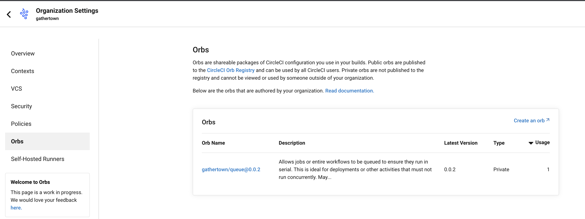

## Description

To publish our private version of queue orb, we need to basically follow this guide:
https://circleci.com/docs/orb-author-validate-publish/

In summary, that requires:

* Apply changes/fixes we want on this repo
* Claim a circleci namespace for our org: `circleci namespace create gathertown --org-id $ORG_ID` - this needs to be done just once.
* Create circleci orb create gathertown/queue --private
* Pack our orb changes: `circleci config pack src/ > pack.yaml`
* Validate orb config: `circleci config validate  --org-slug github/gathertown --token $CIRCLECI_CLI_TOKEN config.yml`
* Publish a dev version of our custom orb: `circleci orb publish pack.yaml  gathertown/queue@dev:first`
* When ready, publish a production ready orb version from the above dev version: `circleci orb publish promote gathertown/queue@dev:first patch` - Using the following command will increment the dev version to become 0.0.1
* List your org's private orbs: `circleci orb list gathertown --private`
* (Optional) Add the Build category to this orb: `circleci orb add-to-category gathertown/queue Build`

Organization's private orbs can be found also from CircleCI Dashboard, on the `Organization Settings / Orbs` section:

## Roadmap

* Automate orb publishing method - TODO
